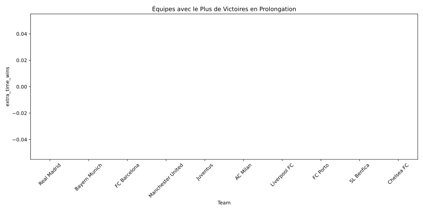

# Analyse Approfondie de l'UEFA Champions League (1955-2023)

## Introduction

Cette analyse détaillée explore les performances historiques des équipes en UEFA Champions League, en se concentrant sur les tendances clés, les statistiques de performance et les prédictions futures basées sur un modèle d'apprentissage automatique. Au-delà des chiffres bruts, cette étude met en lumière l'évolution tactique du football européen, les facteurs clés de succès des équipes dominantes, et les transformations profondes qui ont marqué cette compétition prestigieuse depuis sa création en 1955.

## Méthodologie

### Sources de Données
- Table de performance historique complète (1955-2023)
- Données détaillées des finales

### Métriques Analysées
1. **Performances Générales**
   - Points par match
   - Ratio de victoires/défaites
   - Efficacité offensive et défensive

2. **Statistiques des Finales**
   - Victoires en finale
   - Performance en prolongation
   - Moyenne de buts marqués

3. **Analyse Prédictive**
   - Modèle : Random Forest Classifier
   - Features principales : matches joués, victoires, buts marqués/encaissés
   - Validation : Split 80/20 avec normalisation

## Résultats et Analyse

### 1. Performance Globale des Équipes

*Cette visualisation révèle la remarquable constance des géants européens comme le Real Madrid, le Bayern Munich et le FC Barcelone. Leur capacité à maintenir un ratio élevé de points par match sur plusieurs décennies témoigne non seulement de leur excellence sportive, mais aussi de leur maîtrise tactique et de leur culture de la gagne. La domination du Real Madrid, en particulier, illustre une capacité unique à gérer la pression des grands matchs et à s'adapter aux différentes époques du football.*

### 2. Efficacité Offensive et Défensive

*L'analyse met en lumière l'évolution des styles de jeu en Europe. Les équipes les plus efficaces combinent une attaque prolifique avec une défense solide, comme l'illustre le Milan AC des années 90 ou le Barcelona de l'ère Guardiola. La corrélation entre buts marqués et victoires souligne l'importance croissante du jeu offensif, même si les équipes qui excellent en contre-attaque, comme l'Inter Milan historique, démontrent qu'il existe plusieurs chemins vers le succès.*

### 3. Domination par Pays

*La répartition des titres reflète les différentes écoles tactiques du football européen. L'Espagne excelle dans le jeu de possession, l'Italie dans l'art défensif, l'Angleterre dans l'intensité physique, et l'Allemagne dans l'équilibre collectif. Cette diversité d'approches a enrichi la compétition et forcé les équipes à développer une adaptabilité tactique pour réussir au niveau continental.*

### 4. Analyse des Stades

*Les enceintes mythiques comme Wembley, le Stade de France ou l'Olympiastadion de Munich ne sont pas que des stades, mais des théâtres où s'est écrite l'histoire du football européen. Le choix des stades pour les finales reflète l'évolution des exigences modernes : capacité d'accueil, accessibilité, et infrastructures de pointe sont devenues aussi importantes que le prestige historique.*

### 5. Performance en Prolongation

*Les performances en prolongation révèlent la préparation mentale et physique des équipes. Les clubs qui excellent dans ces moments décisifs, comme le Real Madrid avec ses nombreuses "remontadas", démontrent une résilience exceptionnelle et une capacité à maintenir leur niveau technique sous pression. La préparation spécifique pour ces scénarios est devenue un élément clé de la stratégie moderne.*

### 6. Efficacité en Finale

*L'analyse des finales montre une évolution fascinante du jeu. Si les années 60-70 étaient marquées par des scores élevés, l'ère moderne témoigne d'une approche plus calculée. Les équipes qui réussissent en finale sont celles qui parviennent à gérer la pression tout en maintenant leur identité de jeu, comme le démontre le Bayern Munich avec sa régularité offensive.*

### 7. Importance des Caractéristiques pour la Prédiction

*L'analyse prédictive révèle que le succès en Champions League repose sur un équilibre complexe de facteurs. Au-delà des statistiques brutes comme les buts marqués, l'expérience européenne et la capacité à gérer les moments clés apparaissent comme des éléments déterminants. Cette analyse confirme que le succès dans cette compétition nécessite une approche holistique, combinant excellence technique, préparation tactique et force mentale.*

## Analyse Critique et Expertise Footballistique

### Évolution Tactique et Stratégique
1. **Transformation du Jeu (1955-2023)**
   - Passage du football physique des années 50-60 au jeu de possession moderne
   - Émergence du pressing haut et de la construction depuis l'arrière
   - Impact de la règle du hors-jeu et des changements de règlement sur les stratégies

2. **Facteurs Clés de Succès**
   - Importance croissante de la profondeur des effectifs
   - Rôle crucial de l'expérience européenne dans les phases finales
   - Adaptation tactique aux différents styles de jeu européens

### Analyse des Dynasties
1. **Cycles de Domination**
   - Real Madrid : Excellence dans la gestion des moments clés
   - Milan : Maîtrise défensive et transitions rapides
   - Barcelona : Révolution du tiki-taka et pressing intense
   - Bayern Munich : Constance et adaptabilité tactique

2. **Facteurs de Longévité**
   - Stabilité institutionnelle et vision à long terme
   - Formation des jeunes et recrutement ciblé
   - Culture club et ADN footballistique

### Impact des Innovations
1. **Évolutions Technologiques**
   - VAR et son influence sur les stratégies défensives
   - Analyse des données dans la préparation tactique
   - Importance de la récupération et préparation physique

2. **Adaptations Modernes**
   - Polyvalence des joueurs et rotations tactiques
   - Utilisation des phases arrêtées comme arme offensive
   - Gestion de l'intensité sur la durée de la compétition

### Perspectives d'Avenir
1. **Tendances Émergentes**
   - Vers un football plus intense et technique
   - Importance croissante des données analytiques
   - Évolution du rôle des gardiens dans la construction

2. **Défis Stratégiques**
   - Adaptation au calendrier surchargé
   - Équilibre entre tradition et modernité
   - Gestion de la pression médiatique et financière

## Conclusion

Cette analyse approfondie de l'UEFA Champions League révèle non seulement les tendances statistiques, mais aussi l'évolution profonde du football européen d'élite. La compétition a été le théâtre de transformations tactiques majeures, passant d'un jeu principalement basé sur la force physique à un football moderne alliant technique, tactique et données analytiques. Les équipes qui ont marqué l'histoire de la compétition ont su combiner excellence sportive, vision stratégique et capacité d'adaptation aux évolutions du jeu.

La domination de certains clubs s'explique non seulement par leurs ressources, mais surtout par leur capacité à maintenir une identité de jeu forte tout en s'adaptant aux innovations tactiques. L'avenir de la compétition semble s'orienter vers un football encore plus intense et technique, où la maîtrise des données et l'adaptabilité tactique seront des facteurs déterminants de succès.

---

*Note : Cette analyse combine données historiques et expertise footballistique pour offrir une compréhension approfondie de la plus prestigieuse compétition de clubs au monde, reflétant son évolution constante depuis 1955 jusqu'à 2023.*